# HireFlow Architecture

This document provides a comprehensive view of the HireFlow system architecture, database schema, and UML diagrams.

## Table of Contents

- [System Overview](#system-overview)
- [Database Schema (ERD)](#database-schema-erd)
- [Component Diagram](#component-diagram)
- [Class Diagrams](#class-diagrams)
- [Sequence Diagrams](#sequence-diagrams)
- [State Diagrams](#state-diagrams)

---

## System Overview

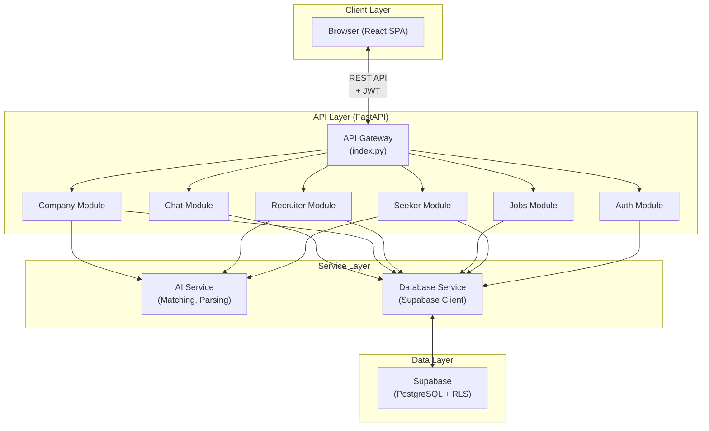
```mermaid
flowchart TB
    subgraph Client["Client Layer"]
        Browser["Browser (React SPA)"]
    end

    subgraph API["API Layer (FastAPI)"]
        Gateway["API Gateway\n(index.py)"]
        Auth["Auth Module"]
        Seeker["Seeker Module"]
        Jobs["Jobs Module"]
        Recruiter["Recruiter Module"]
        Company["Company Module"]
        Chat["Chat Module"]
    end

    subgraph Services["Service Layer"]
        AIService["AI Service\n(Matching, Parsing)"]
        DBService["Database Service\n(Supabase Client)"]
    end

    subgraph Data["Data Layer"]
        Supabase["Supabase\n(PostgreSQL + RLS)"]
    end

    Browser <-->|"REST API\n+ JWT"| Gateway
    Gateway --> Auth
    Gateway --> Seeker
    Gateway --> Jobs
    Gateway --> Recruiter
    Gateway --> Company
    Gateway --> Chat

    Auth --> DBService
    Seeker --> AIService
    Seeker --> DBService
    Jobs --> DBService
    Recruiter --> AIService
    Recruiter --> DBService
    Company --> AIService
    Company --> DBService
    Chat --> DBService

    DBService <--> Supabase
```

---

## Database Schema (ERD)

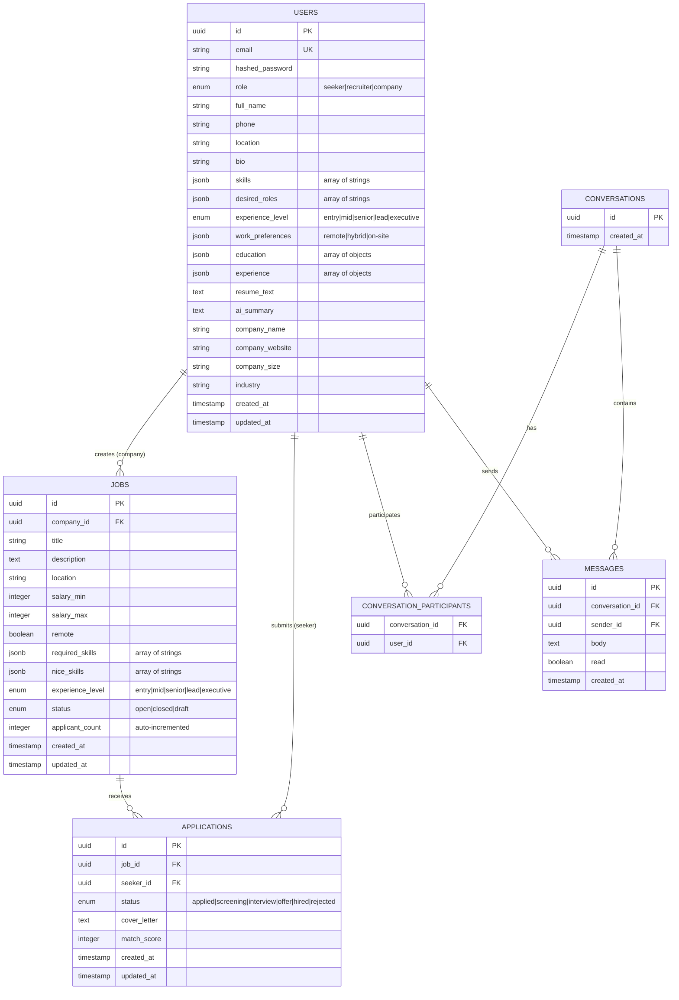
```mermaid
erDiagram
    USERS {
        uuid id PK
        string email UK
        string hashed_password
        enum role "seeker|recruiter|company"
        string full_name
        string phone
        string location
        string bio
        jsonb skills "array of strings"
        jsonb desired_roles "array of strings"
        enum experience_level "entry|mid|senior|lead|executive"
        jsonb work_preferences "remote|hybrid|on-site"
        jsonb education "array of objects"
        jsonb experience "array of objects"
        text resume_text
        text ai_summary
        string company_name
        string company_website
        string company_size
        string industry
        timestamp created_at
        timestamp updated_at
    }

    JOBS {
        uuid id PK
        uuid company_id FK
        string title
        text description
        string location
        integer salary_min
        integer salary_max
        boolean remote
        jsonb required_skills "array of strings"
        jsonb nice_skills "array of strings"
        enum experience_level "entry|mid|senior|lead|executive"
        enum status "open|closed|draft"
        integer applicant_count "auto-incremented"
        timestamp created_at
        timestamp updated_at
    }

    APPLICATIONS {
        uuid id PK
        uuid job_id FK
        uuid seeker_id FK
        enum status "applied|screening|interview|offer|hired|rejected"
        text cover_letter
        integer match_score
        timestamp created_at
        timestamp updated_at
    }

    CONVERSATIONS {
        uuid id PK
        timestamp created_at
    }

    CONVERSATION_PARTICIPANTS {
        uuid conversation_id FK
        uuid user_id FK
    }

    MESSAGES {
        uuid id PK
        uuid conversation_id FK
        uuid sender_id FK
        text body
        boolean read
        timestamp created_at
    }

    USERS ||--o{ JOBS : "creates (company)"
    USERS ||--o{ APPLICATIONS : "submits (seeker)"
    JOBS ||--o{ APPLICATIONS : "receives"
    USERS ||--o{ CONVERSATION_PARTICIPANTS : "participates"
    CONVERSATIONS ||--o{ CONVERSATION_PARTICIPANTS : "has"
    CONVERSATIONS ||--o{ MESSAGES : "contains"
    USERS ||--o{ MESSAGES : "sends"
```

---

## Component Diagram

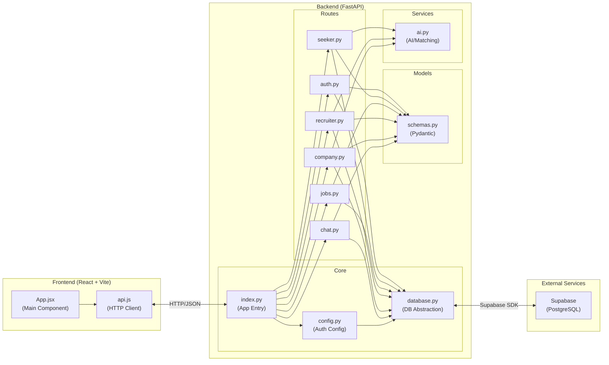
```mermaid
flowchart LR
    subgraph Frontend["Frontend (React + Vite)"]
        App["App.jsx\n(Main Component)"]
        APIClient["api.js\n(HTTP Client)"]
        App --> APIClient
    end

    subgraph Backend["Backend (FastAPI)"]
        subgraph Core["Core"]
            Index["index.py\n(App Entry)"]
            Config["config.py\n(Auth Config)"]
            Database["database.py\n(DB Abstraction)"]
        end

        subgraph Routes["Routes"]
            AuthRoute["auth.py"]
            SeekerRoute["seeker.py"]
            JobsRoute["jobs.py"]
            RecruiterRoute["recruiter.py"]
            CompanyRoute["company.py"]
            ChatRoute["chat.py"]
        end

        subgraph Models["Models"]
            Schemas["schemas.py\n(Pydantic)"]
        end

        subgraph ServicesLayer["Services"]
            AI["ai.py\n(AI/Matching)"]
        end

        Index --> Config
        Index --> AuthRoute
        Index --> SeekerRoute
        Index --> JobsRoute
        Index --> RecruiterRoute
        Index --> CompanyRoute
        Index --> ChatRoute

        AuthRoute --> Schemas
        SeekerRoute --> Schemas
        JobsRoute --> Schemas
        RecruiterRoute --> Schemas
        CompanyRoute --> Schemas
        ChatRoute --> Schemas

        SeekerRoute --> AI
        RecruiterRoute --> AI
        CompanyRoute --> AI

        AuthRoute --> Database
        SeekerRoute --> Database
        JobsRoute --> Database
        RecruiterRoute --> Database
        CompanyRoute --> Database
        ChatRoute --> Database

        Config --> Database
    end

    subgraph External["External Services"]
        Supabase["Supabase\n(PostgreSQL)"]
    end

    APIClient <-->|"HTTP/JSON"| Index
    Database <-->|"Supabase SDK"| Supabase
```

---

## Class Diagrams

### User Models

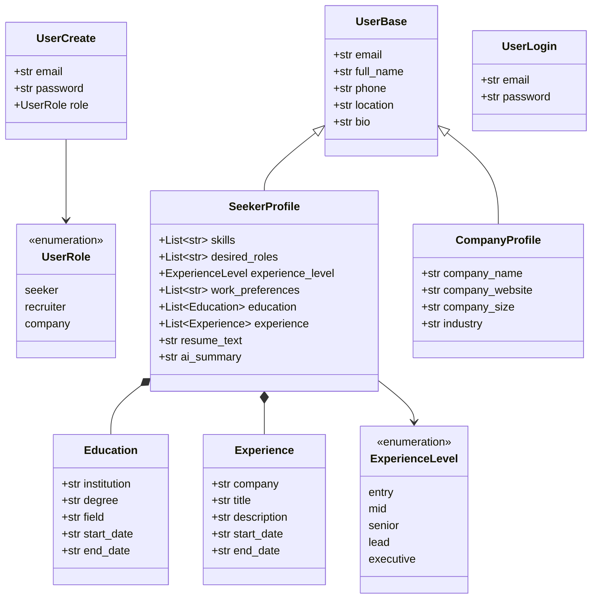
```mermaid
classDiagram
    class UserRole {
        <<enumeration>>
        seeker
        recruiter
        company
    }

    class ExperienceLevel {
        <<enumeration>>
        entry
        mid
        senior
        lead
        executive
    }

    class UserBase {
        +str email
        +str full_name
        +str phone
        +str location
        +str bio
    }

    class UserCreate {
        +str email
        +str password
        +UserRole role
    }

    class UserLogin {
        +str email
        +str password
    }

    class SeekerProfile {
        +List~str~ skills
        +List~str~ desired_roles
        +ExperienceLevel experience_level
        +List~str~ work_preferences
        +List~Education~ education
        +List~Experience~ experience
        +str resume_text
        +str ai_summary
    }

    class CompanyProfile {
        +str company_name
        +str company_website
        +str company_size
        +str industry
    }

    class Education {
        +str institution
        +str degree
        +str field
        +str start_date
        +str end_date
    }

    class Experience {
        +str company
        +str title
        +str description
        +str start_date
        +str end_date
    }

    UserBase <|-- SeekerProfile
    UserBase <|-- CompanyProfile
    SeekerProfile *-- Education
    SeekerProfile *-- Experience
    SeekerProfile --> ExperienceLevel
    UserCreate --> UserRole
```

### Job Models

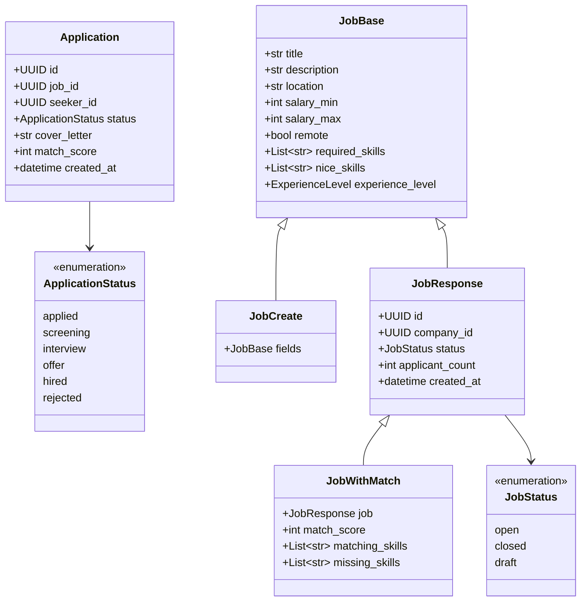
```mermaid
classDiagram
    class JobStatus {
        <<enumeration>>
        open
        closed
        draft
    }

    class ApplicationStatus {
        <<enumeration>>
        applied
        screening
        interview
        offer
        hired
        rejected
    }

    class JobBase {
        +str title
        +str description
        +str location
        +int salary_min
        +int salary_max
        +bool remote
        +List~str~ required_skills
        +List~str~ nice_skills
        +ExperienceLevel experience_level
    }

    class JobCreate {
        +JobBase fields
    }

    class JobResponse {
        +UUID id
        +UUID company_id
        +JobStatus status
        +int applicant_count
        +datetime created_at
    }

    class JobWithMatch {
        +JobResponse job
        +int match_score
        +List~str~ matching_skills
        +List~str~ missing_skills
    }

    class Application {
        +UUID id
        +UUID job_id
        +UUID seeker_id
        +ApplicationStatus status
        +str cover_letter
        +int match_score
        +datetime created_at
    }

    JobBase <|-- JobCreate
    JobBase <|-- JobResponse
    JobResponse <|-- JobWithMatch
    JobResponse --> JobStatus
    Application --> ApplicationStatus
```

### Service Classes

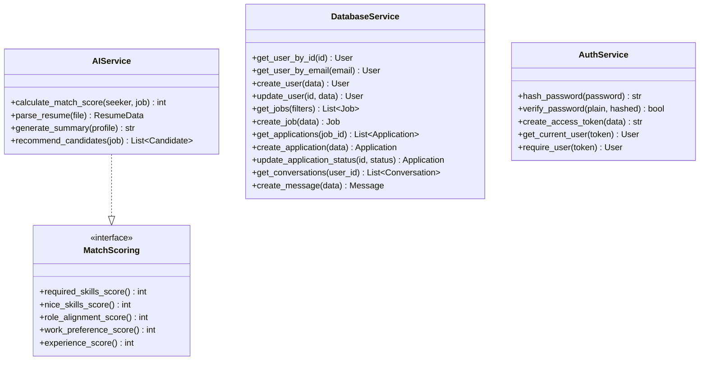
```mermaid
classDiagram
    class AIService {
        +calculate_match_score(seeker, job) int
        +parse_resume(file) ResumeData
        +generate_summary(profile) str
        +recommend_candidates(job) List~Candidate~
    }

    class DatabaseService {
        +get_user_by_id(id) User
        +get_user_by_email(email) User
        +create_user(data) User
        +update_user(id, data) User
        +get_jobs(filters) List~Job~
        +create_job(data) Job
        +get_applications(job_id) List~Application~
        +create_application(data) Application
        +update_application_status(id, status) Application
        +get_conversations(user_id) List~Conversation~
        +create_message(data) Message
    }

    class AuthService {
        +hash_password(password) str
        +verify_password(plain, hashed) bool
        +create_access_token(data) str
        +get_current_user(token) User
        +require_user(token) User
    }

    class MatchScoring {
        <<interface>>
        +required_skills_score() int
        +nice_skills_score() int
        +role_alignment_score() int
        +work_preference_score() int
        +experience_score() int
    }

    AIService ..|> MatchScoring
```

---

## Sequence Diagrams

### User Registration Flow

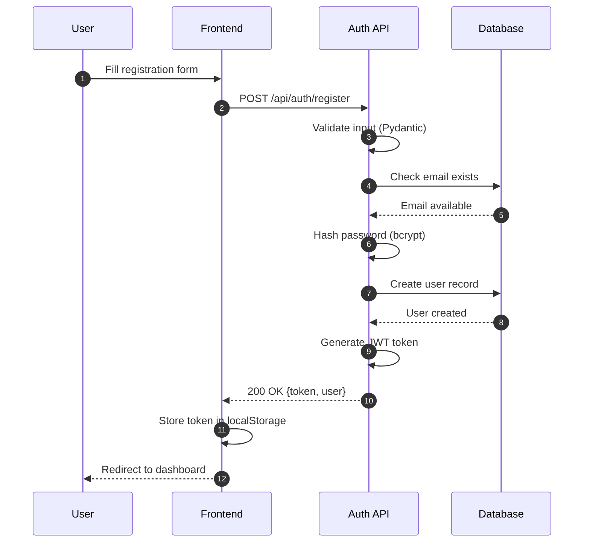
```mermaid
sequenceDiagram
    autonumber
    participant U as User
    participant F as Frontend
    participant A as Auth API
    participant DB as Database

    U->>F: Fill registration form
    F->>A: POST /api/auth/register
    A->>A: Validate input (Pydantic)
    A->>DB: Check email exists
    DB-->>A: Email available
    A->>A: Hash password (bcrypt)
    A->>DB: Create user record
    DB-->>A: User created
    A->>A: Generate JWT token
    A-->>F: 200 OK {token, user}
    F->>F: Store token in localStorage
    F-->>U: Redirect to dashboard
```

### Job Application Flow

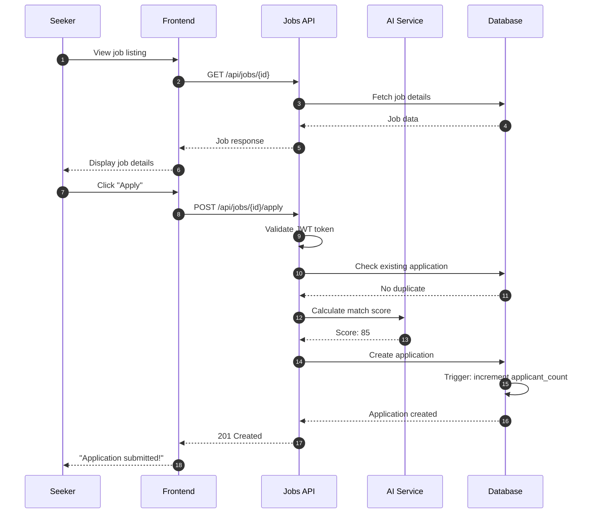
```mermaid
sequenceDiagram
    autonumber
    participant S as Seeker
    participant F as Frontend
    participant J as Jobs API
    participant AI as AI Service
    participant DB as Database

    S->>F: View job listing
    F->>J: GET /api/jobs/{id}
    J->>DB: Fetch job details
    DB-->>J: Job data
    J-->>F: Job response
    F-->>S: Display job details

    S->>F: Click "Apply"
    F->>J: POST /api/jobs/{id}/apply
    J->>J: Validate JWT token
    J->>DB: Check existing application
    DB-->>J: No duplicate
    J->>AI: Calculate match score
    AI-->>J: Score: 85
    J->>DB: Create application
    DB->>DB: Trigger: increment applicant_count
    DB-->>J: Application created
    J-->>F: 201 Created
    F-->>S: "Application submitted!"
```

### AI Job Matching Flow

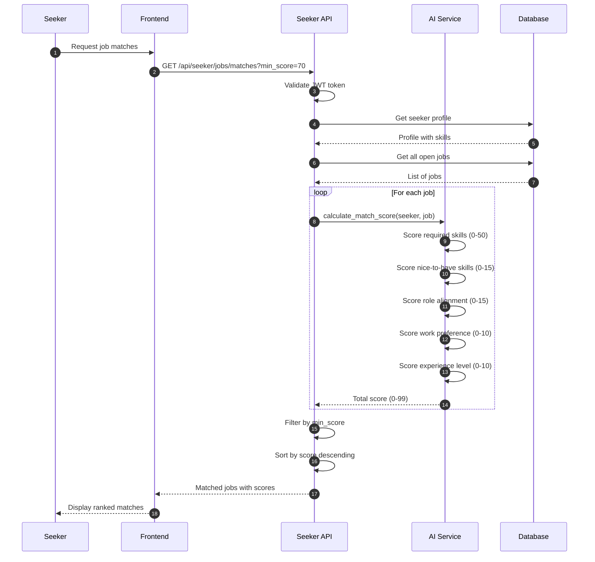
```mermaid
sequenceDiagram
    autonumber
    participant S as Seeker
    participant F as Frontend
    participant API as Seeker API
    participant AI as AI Service
    participant DB as Database

    S->>F: Request job matches
    F->>API: GET /api/seeker/jobs/matches?min_score=70
    API->>API: Validate JWT token
    API->>DB: Get seeker profile
    DB-->>API: Profile with skills
    API->>DB: Get all open jobs
    DB-->>API: List of jobs

    loop For each job
        API->>AI: calculate_match_score(seeker, job)
        AI->>AI: Score required skills (0-50)
        AI->>AI: Score nice-to-have skills (0-15)
        AI->>AI: Score role alignment (0-15)
        AI->>AI: Score work preference (0-10)
        AI->>AI: Score experience level (0-10)
        AI-->>API: Total score (0-99)
    end

    API->>API: Filter by min_score
    API->>API: Sort by score descending
    API-->>F: Matched jobs with scores
    F-->>S: Display ranked matches
```

### Chat Message Flow

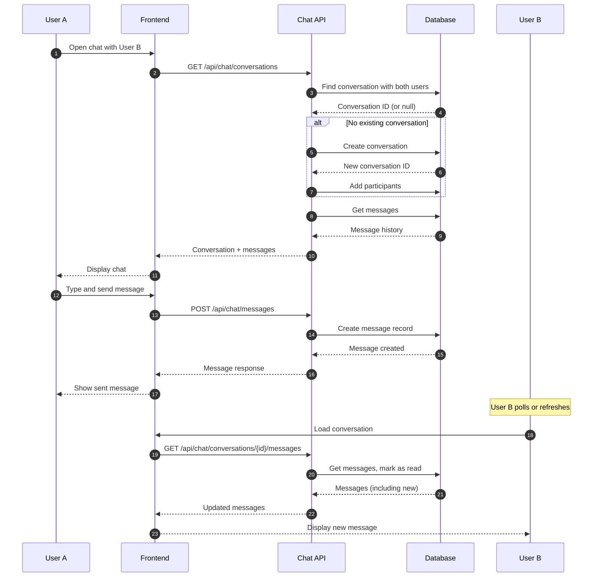
```mermaid
sequenceDiagram
    autonumber
    participant U1 as User A
    participant F as Frontend
    participant C as Chat API
    participant DB as Database
    participant U2 as User B

    U1->>F: Open chat with User B
    F->>C: GET /api/chat/conversations
    C->>DB: Find conversation with both users
    DB-->>C: Conversation ID (or null)

    alt No existing conversation
        C->>DB: Create conversation
        DB-->>C: New conversation ID
        C->>DB: Add participants
    end

    C->>DB: Get messages
    DB-->>C: Message history
    C-->>F: Conversation + messages
    F-->>U1: Display chat

    U1->>F: Type and send message
    F->>C: POST /api/chat/messages
    C->>DB: Create message record
    DB-->>C: Message created
    C-->>F: Message response
    F-->>U1: Show sent message

    Note over U2: User B polls or refreshes
    U2->>F: Load conversation
    F->>C: GET /api/chat/conversations/{id}/messages
    C->>DB: Get messages, mark as read
    DB-->>C: Messages (including new)
    C-->>F: Updated messages
    F-->>U2: Display new message
```

### Recruiter Pipeline Flow

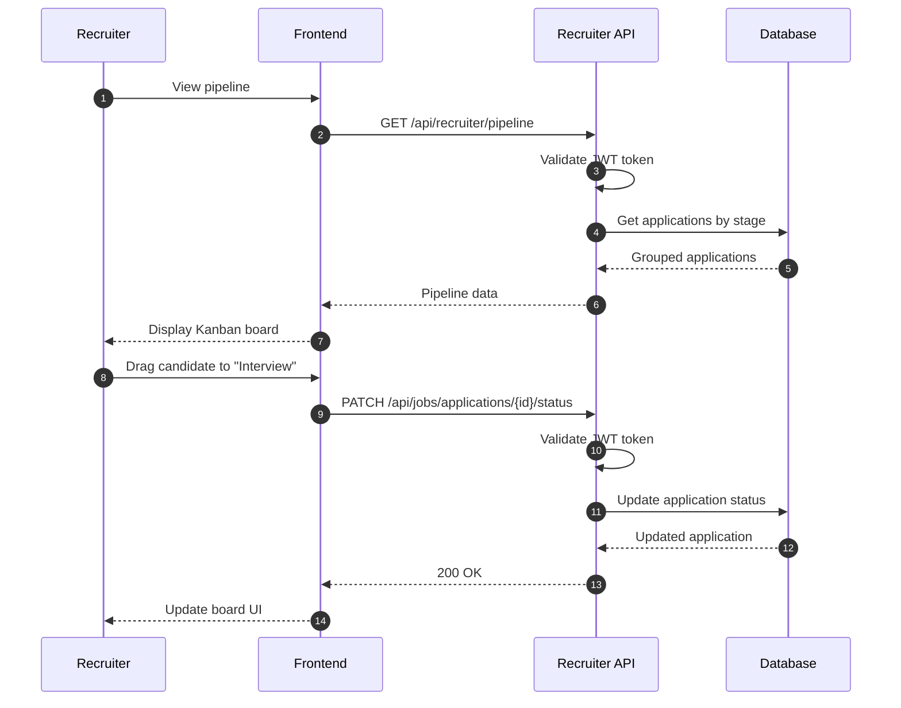
```mermaid
sequenceDiagram
    autonumber
    participant R as Recruiter
    participant F as Frontend
    participant API as Recruiter API
    participant DB as Database

    R->>F: View pipeline
    F->>API: GET /api/recruiter/pipeline
    API->>API: Validate JWT token
    API->>DB: Get applications by stage
    DB-->>API: Grouped applications
    API-->>F: Pipeline data
    F-->>R: Display Kanban board

    R->>F: Drag candidate to "Interview"
    F->>API: PATCH /api/jobs/applications/{id}/status
    API->>API: Validate JWT token
    API->>DB: Update application status
    DB-->>API: Updated application
    API-->>F: 200 OK
    F-->>R: Update board UI
```

---

## State Diagrams

### Application Status State Machine

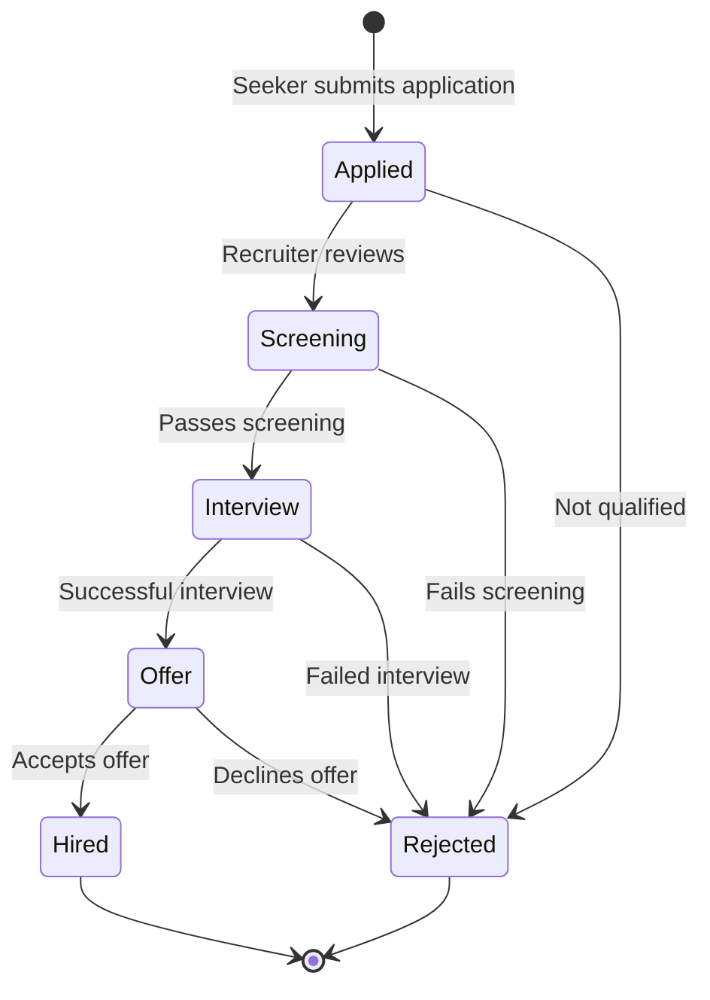
```mermaid
stateDiagram-v2
    [*] --> Applied: Seeker submits application

    Applied --> Screening: Recruiter reviews
    Applied --> Rejected: Not qualified

    Screening --> Interview: Passes screening
    Screening --> Rejected: Fails screening

    Interview --> Offer: Successful interview
    Interview --> Rejected: Failed interview

    Offer --> Hired: Accepts offer
    Offer --> Rejected: Declines offer

    Hired --> [*]
    Rejected --> [*]
```

### Job Status State Machine

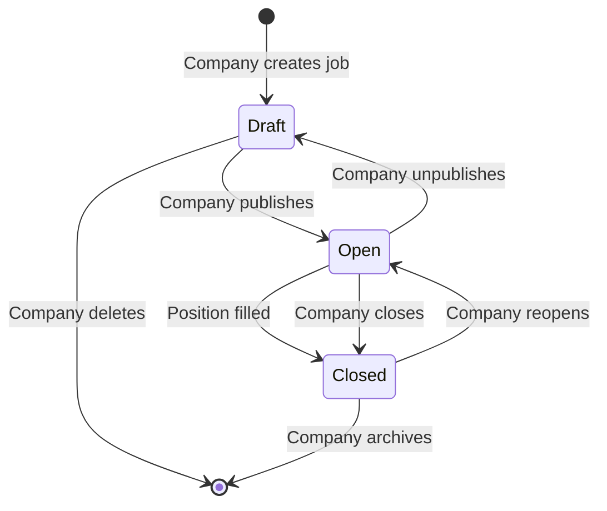
```mermaid
stateDiagram-v2
    [*] --> Draft: Company creates job

    Draft --> Open: Company publishes
    Draft --> [*]: Company deletes

    Open --> Closed: Position filled
    Open --> Closed: Company closes
    Open --> Draft: Company unpublishes

    Closed --> Open: Company reopens
    Closed --> [*]: Company archives
```

### User Authentication State

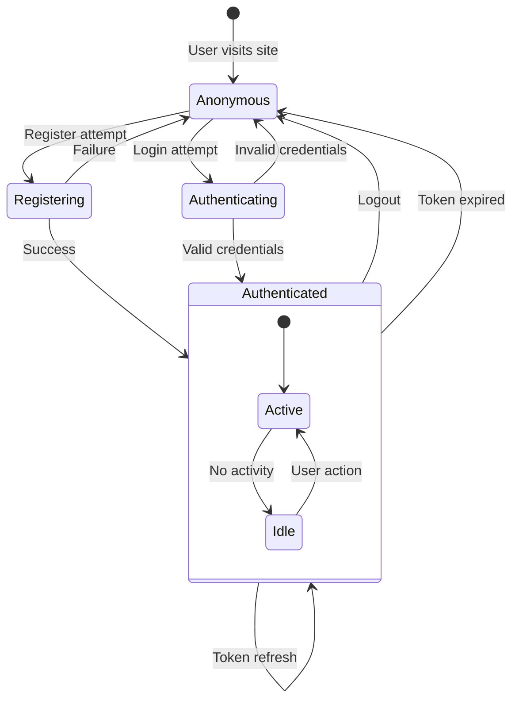
```mermaid
stateDiagram-v2
    [*] --> Anonymous: User visits site

    Anonymous --> Authenticating: Login attempt
    Anonymous --> Registering: Register attempt

    Registering --> Authenticated: Success
    Registering --> Anonymous: Failure

    Authenticating --> Authenticated: Valid credentials
    Authenticating --> Anonymous: Invalid credentials

    Authenticated --> Anonymous: Logout
    Authenticated --> Authenticated: Token refresh
    Authenticated --> Anonymous: Token expired

    state Authenticated {
        [*] --> Active
        Active --> Idle: No activity
        Idle --> Active: User action
    }
```

---

## Data Flow Diagram

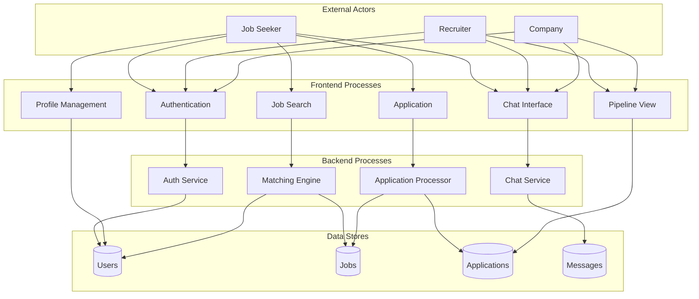
```mermaid
flowchart TD
    subgraph External["External Actors"]
        Seeker["Job Seeker"]
        Recruiter["Recruiter"]
        Company["Company"]
    end

    subgraph Frontend["Frontend Processes"]
        Auth["Authentication"]
        Profile["Profile Management"]
        JobSearch["Job Search"]
        Apply["Application"]
        Pipeline["Pipeline View"]
        ChatUI["Chat Interface"]
    end

    subgraph Backend["Backend Processes"]
        AuthAPI["Auth Service"]
        MatchEngine["Matching Engine"]
        AppProcessor["Application Processor"]
        ChatService["Chat Service"]
    end

    subgraph DataStores["Data Stores"]
        UserDB[(Users)]
        JobDB[(Jobs)]
        AppDB[(Applications)]
        MsgDB[(Messages)]
    end

    Seeker --> Auth
    Recruiter --> Auth
    Company --> Auth

    Auth --> AuthAPI
    AuthAPI --> UserDB

    Seeker --> Profile
    Seeker --> JobSearch
    Seeker --> Apply

    Profile --> UserDB
    JobSearch --> MatchEngine
    MatchEngine --> JobDB
    MatchEngine --> UserDB

    Apply --> AppProcessor
    AppProcessor --> AppDB
    AppProcessor --> JobDB

    Recruiter --> Pipeline
    Pipeline --> AppDB

    Company --> Pipeline

    Seeker --> ChatUI
    Recruiter --> ChatUI
    Company --> ChatUI
    ChatUI --> ChatService
    ChatService --> MsgDB
```

---

## Deployment Architecture

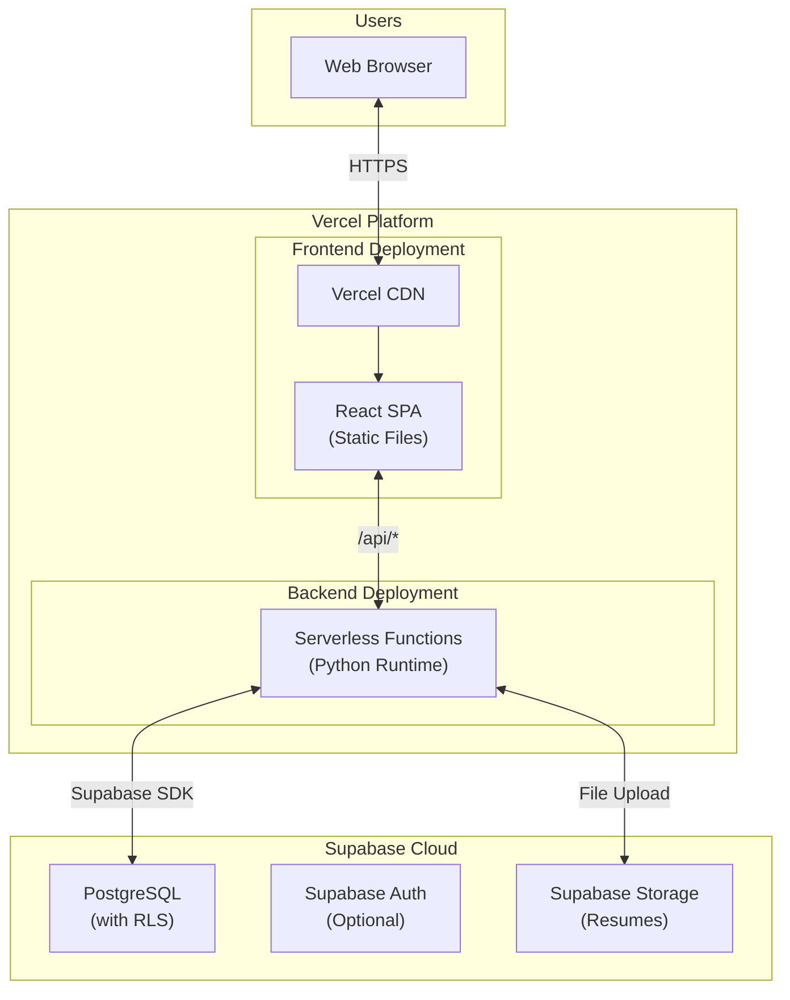
```mermaid
flowchart TB
    subgraph Users["Users"]
        Browser["Web Browser"]
    end

    subgraph Vercel["Vercel Platform"]
        subgraph FrontendDeploy["Frontend Deployment"]
            CDN["Vercel CDN"]
            SPA["React SPA\n(Static Files)"]
        end

        subgraph BackendDeploy["Backend Deployment"]
            Serverless["Serverless Functions\n(Python Runtime)"]
        end
    end

    subgraph Supabase["Supabase Cloud"]
        PG["PostgreSQL\n(with RLS)"]
        SupaAuth["Supabase Auth\n(Optional)"]
        Storage["Supabase Storage\n(Resumes)"]
    end

    Browser <-->|"HTTPS"| CDN
    CDN --> SPA
    SPA <-->|"/api/*"| Serverless
    Serverless <-->|"Supabase SDK"| PG
    Serverless <-->|"File Upload"| Storage
```

---

## Security Architecture

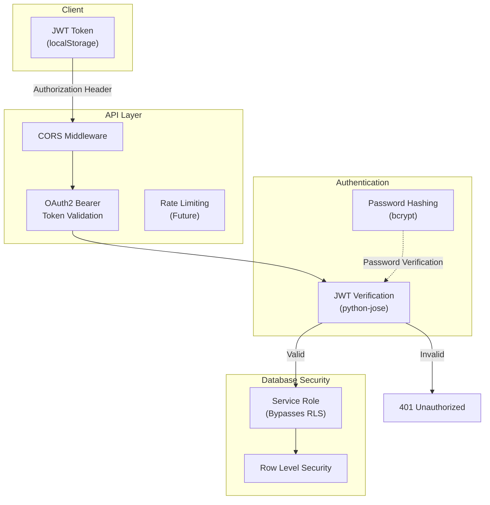
```mermaid
flowchart TD
    subgraph Client["Client"]
        Token["JWT Token\n(localStorage)"]
    end

    subgraph API["API Layer"]
        CORS["CORS Middleware"]
        OAuth["OAuth2 Bearer\nToken Validation"]
        RateLimit["Rate Limiting\n(Future)"]
    end

    subgraph Auth["Authentication"]
        JWT["JWT Verification\n(python-jose)"]
        Bcrypt["Password Hashing\n(bcrypt)"]
    end

    subgraph Database["Database Security"]
        RLS["Row Level Security"]
        ServiceRole["Service Role\n(Bypasses RLS)"]
    end

    Token -->|"Authorization Header"| CORS
    CORS --> OAuth
    OAuth --> JWT
    JWT -->|"Valid"| ServiceRole
    JWT -->|"Invalid"| Reject["401 Unauthorized"]
    ServiceRole --> RLS

    Bcrypt -.->|"Password Verification"| JWT
```

---

## Match Scoring Algorithm

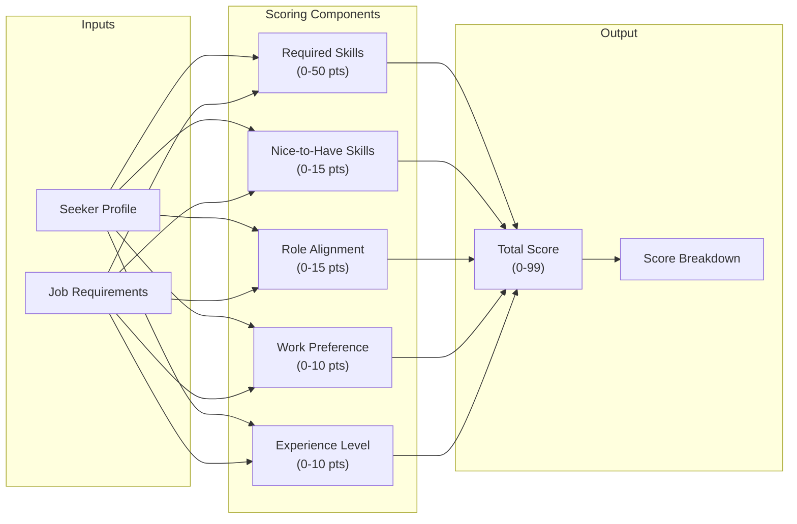
```mermaid
flowchart LR
    subgraph Input["Inputs"]
        SeekerProfile["Seeker Profile"]
        JobRequirements["Job Requirements"]
    end

    subgraph Scoring["Scoring Components"]
        Required["Required Skills\n(0-50 pts)"]
        Nice["Nice-to-Have Skills\n(0-15 pts)"]
        Role["Role Alignment\n(0-15 pts)"]
        WorkPref["Work Preference\n(0-10 pts)"]
        ExpLevel["Experience Level\n(0-10 pts)"]
    end

    subgraph Output["Output"]
        Total["Total Score\n(0-99)"]
        Breakdown["Score Breakdown"]
    end

    SeekerProfile --> Required
    SeekerProfile --> Nice
    SeekerProfile --> Role
    SeekerProfile --> WorkPref
    SeekerProfile --> ExpLevel

    JobRequirements --> Required
    JobRequirements --> Nice
    JobRequirements --> Role
    JobRequirements --> WorkPref
    JobRequirements --> ExpLevel

    Required --> Total
    Nice --> Total
    Role --> Total
    WorkPref --> Total
    ExpLevel --> Total

    Total --> Breakdown
```
