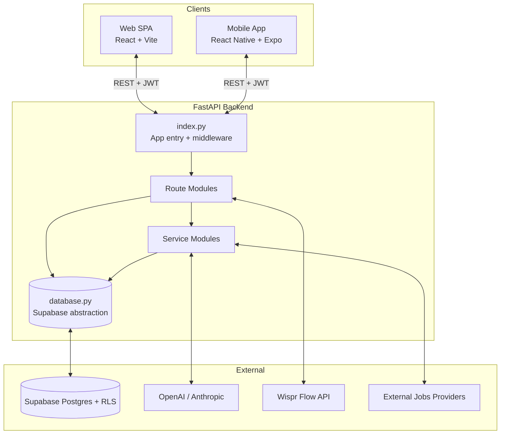
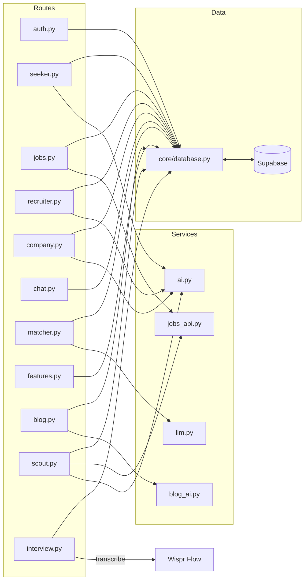
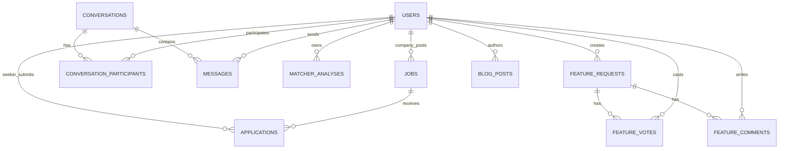
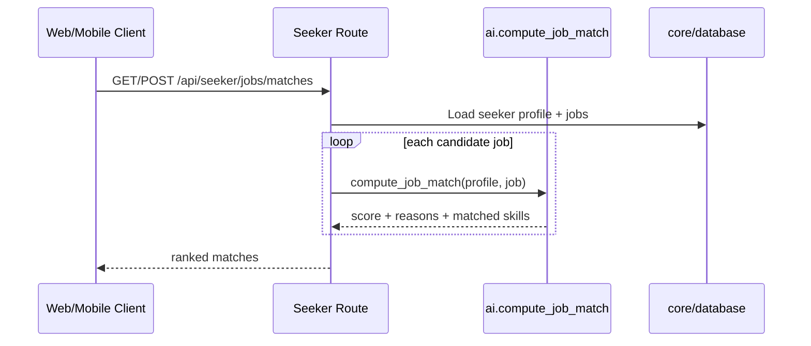
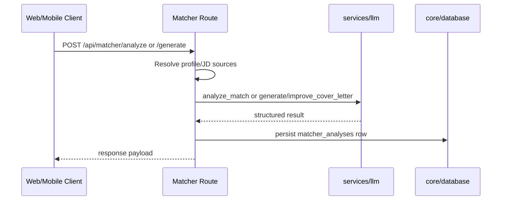
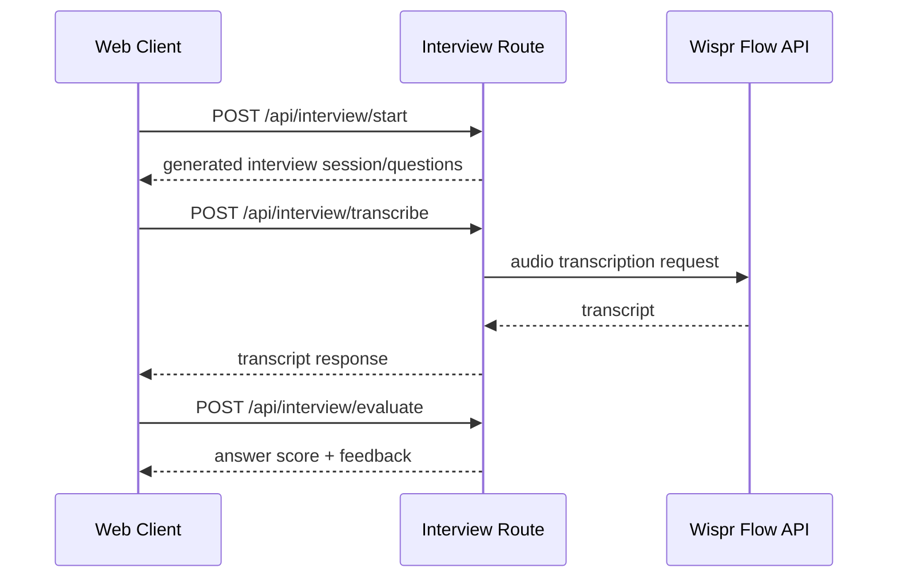

# HireFlow Architecture

This document describes the current architecture in the repository as of May 2026.

## 1. System Overview

HireFlow is a multi-client job platform:

- Web client: React + Vite SPA (`frontend/`)
- Mobile client: React Native + Expo (`mobile/`)
- API backend: FastAPI (`backend/api/`)
- Database: Supabase PostgreSQL with RLS
- AI integrations: OpenAI/Anthropic (matcher + content), Wispr Flow (interview voice transcription), external jobs providers

## 2. Runtime and Deployment

- Backend runtime: Python serverless function on Vercel (`backend/api/index.py`)
- Frontend runtime: Static Vite build on Vercel (`frontend/`)
- Mobile runtime: Expo app (`mobile/`)
- Auth: JWT bearer tokens from backend auth endpoints
- Password security: bcrypt hashing (`backend/api/core/config.py`)
- CORS: allowlist from `ALLOWED_ORIGINS` env var in `backend/api/index.py`

## 3. Backend Architecture

### 3.1 Core modules

- `backend/api/index.py`: app setup, CORS, router registration, health endpoints, transport error handling
- `backend/api/core/config.py`: auth dependencies (`get_current_user`, `require_user`), token creation/validation, password hashing
- `backend/api/core/database.py`: all Supabase queries and data access helpers
- `backend/api/models/schemas.py`: Pydantic enums and request/response models

### 3.2 Registered API route groups

Current router prefixes in `backend/api/routes/`:

- `/api/auth` -> `auth.py`
- `/api/seeker` -> `seeker.py`
- `/api/jobs` -> `jobs.py`
- `/api/recruiter` -> `recruiter.py`
- `/api/company` -> `company.py`
- `/api/chat` -> `chat.py`
- `/api/matcher` -> `matcher.py`
- `/api/features` -> `features.py`
- `/api/blog` -> `blog.py`
- `/api/scout` -> `scout.py`
- `/api/interview` -> `interview.py`

Health endpoints:

- `GET /api`
- `GET /api/health`

### 3.3 Service layer

- `api/services/ai.py`
  - Job matching (`compute_job_match`) with LLM-first strategy and rule-based fallback
  - Resume parsing for PDF/DOCX and profile enrichment helpers
- `api/services/llm.py`
  - Provider-agnostic LLM wrapper (OpenAI or Anthropic)
  - Matcher operations: analyze resume/JD fit, generate/improve cover letters
- `api/services/blog_ai.py`
  - AI enrichment for blog metadata (SEO and related skills)
- `api/services/jobs_api.py`
  - External job provider aggregation for search and scout flows

### 3.4 Route-to-service dependency map

## 4. Data Model (Supabase)

Primary tables from migrations in `backend/supabase/migrations/`:

- Core platform
  - `users`
  - `jobs`
  - `applications`
  - `conversations`
  - `conversation_participants`
  - `messages`
- Matcher
  - `matcher_analyses`
- Feature request board
  - `feature_requests`
  - `feature_votes`
  - `feature_comments`
- Blog / pressroom
  - `blog_posts`

All tables use RLS and are accessed by backend service role through `core/database.py`.

## 5. Frontend (Web) Architecture

Current frontend is in `frontend/src/` and is hybrid:

- Main shell and app-state orchestration in `App.jsx`
- Reusable UI primitives in `components/`
- Feature modules in `features/` (auth and onboarding)
- Route-like page components in `pages/`:
  - marketing pages
  - blog pages
  - job detail and static pages
- API client in `api.js`
- Shared helpers in `lib/` and static data in `data/`

The web app uses path parsing helpers (`lib/routing`) rather than a dedicated router package.

## 6. Mobile Architecture

Mobile app in `mobile/` uses React Native + Expo:

- Entry: `mobile/App.js`
- Navigation: `mobile/src/navigation/AppNavigator.js`
- Auth state: `mobile/src/services/AuthContext.js`
- API client: `mobile/src/services/api.js`
- Screen modules: `mobile/src/screens/*.js`

Token persistence uses Expo Secure Store on native and localStorage fallback on web.

## 7. Key Product Flows

### 7.1 Seeker matching flow

### 7.2 Matcher flow

### 7.3 Interview bot flow

## 8. Security Model

- JWT bearer auth for protected endpoints
- Role-based behavior implemented in route handlers
- Password hashing via bcrypt
- RLS enabled on all app tables
- Backend uses Supabase service-role key for controlled server-side access
- CORS allowlist enforced via FastAPI middleware

## 9. Current Gaps and Technical Notes

- Recruiters are assigned to individual jobs via the `job_recruiters` table (ADR-0001); hiring-side endpoints are scoped to owned/assigned jobs.
- API client parity between web/mobile and backend endpoints should be verified continuously as endpoints evolve.
- `core/database.py` currently centralizes many domains; splitting by bounded context may improve maintainability as feature count grows.
- Scout and Interview are AI-heavy route modules and may benefit from further extraction into dedicated service modules.
