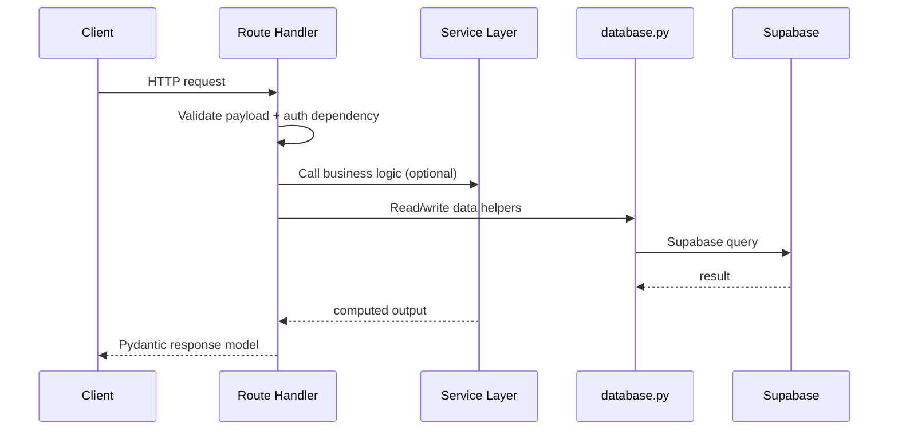

# HireFlow Backend LLD

This backend-focused LLD is a practical implementation guide for FastAPI + Supabase development.

## 1. Backend Boundaries

- Entrypoint: backend/api/index.py
- Auth/security: backend/api/core/config.py
- Data access: backend/api/core/database.py
- Contracts: backend/api/models/schemas.py
- HTTP handlers: backend/api/routes/*.py
- Business and integrations: backend/api/services/*.py

Rule of ownership:
- Route handlers orchestrate request flow and authorization.
- Services hold business logic and external API logic.
- Database module is the only place that talks to Supabase SDK.

## 2. Endpoint Modules

- auth.py: register/login
- seeker.py: profile CRUD, resume upload, AI summary, seeker matches, analytics
- jobs.py: job listing/search/CRUD and applications lifecycle
- recruiter.py: candidate search, pipeline, analytics
- company.py: dashboard, recommendations, analytics
- chat.py: list conversations, list messages, send message
- matcher.py: analyze/generate/improve and history retrieval
- features.py: feature board listing, create, vote, comments, status updates
- blog.py: public posts/categories/related jobs + admin CUD/enrich
- scout.py: AI career-counseling chat endpoint
- interview.py: interview start, transcribe, evaluate

## 3. Request Lifecycle

## 4. Auth and Security Details

- Token algorithm: HS256.
- Token claims include sub and exp.
- Auth dependencies:
  - get_current_user: optional user
  - require_user: enforced auth (401 on failure)
- Password hashing: passlib bcrypt.
- CORS allowlist loaded from ALLOWED_ORIGINS in index.py.
- RLS enabled in Supabase; backend uses service role key.

## 5. Data Access Pattern

The database module contains domain sections:
- Users
- Jobs
- Applications
- Conversations and messages
- Feature requests
- Matcher analyses
- Blog posts

Pattern for every helper:
1. prepare payload (JSONB normalization where needed)
2. execute table query
3. parse/return normalized model dictionary

## 6. Error Mapping

Standard behavior:
- 400: invalid business input/state
- 401: missing/invalid auth
- 403: access denied
- 404: missing resource
- 409: conflict/duplicate
- 502: upstream AI/provider failure
- 503: dependency unavailable (transport or key/config)

Implementation guidance:
- Never leak raw provider stack traces to clients.
- Convert provider failures to stable detail messages.

## 7. Service Contracts

ai.py
- compute_job_match(...) -> dict with match_score and reasons
- LLM-first then fallback rules

llm.py
- analyze_match(resume_text, jd_text, cover_letter?) -> dict
- generate_cover_letter(resume_text, jd_text) -> str
- improve_cover_letter(resume_text, jd_text, cover_letter) -> str

blog_ai.py
- enrich_post(title, body_markdown, category) -> seo and metadata payload

jobs_api.py
- provider aggregation for external search

## 8. Adding a New Backend Feature

1. Add migration in backend/supabase/migrations.
2. Add/extend Pydantic schemas.
3. Add database helpers.
4. Add service logic for non-trivial rules.
5. Add route endpoints and authorization.
6. Register router in index.py if new module.
7. Add tests (unit + integration + regression touchpoints).
8. Update architecture and LLD docs.

## 9. Current Technical Debt Targets

- Split database.py by bounded contexts to reduce merge conflicts.
- Move large AI-heavy route logic from scout/interview into dedicated service classes.
- Add shared external dependency wrapper for consistent retries/timeouts.
