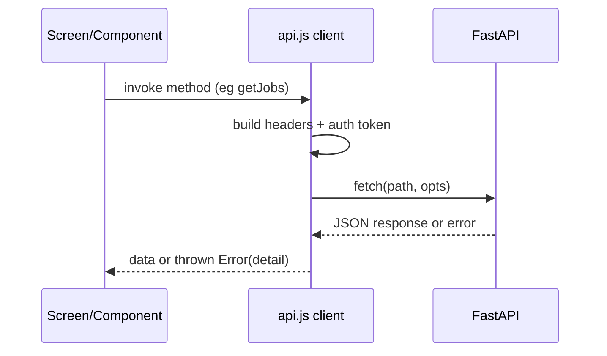

# HireFlow Frontend and Mobile LLD

This LLD describes client-side architecture and API integration behavior for web and mobile apps.

## 1. Web App Structure

Path: frontend/src

- App.jsx: central state orchestration and page rendering
- api.js: HTTP client abstraction
- lib/routing.js: pathname <-> page mapping
- pages/: content screens (marketing, blog, job detail, static)
- features/: auth and onboarding flows
- components/: reusable UI primitives and layouts

Routing model:
- Lightweight path parsing via lib/routing.js
- No dedicated router package at present

## 2. Mobile App Structure

Path: mobile/src

- services/AuthContext.js: auth state and session bootstrap
- services/api.js: HTTP client abstraction
- navigation/AppNavigator.js: authenticated role-based tab stacks
- screens/: page-level views

Role tabs in mobile:
- seeker: jobs/profile/chat/blog/analytics
- recruiter: candidates/chat/blog/analytics/profile
- company: dashboard/chat/blog/analytics/profile

## 3. Client API Contract Pattern

Shared behavior (web/mobile):
- Keep auth token in local persistence
- Send Authorization: Bearer <token> when logged in
- Parse non-2xx responses and throw Error(detail)

Token storage:
- Web: localStorage key jobssearch_token
- Mobile native: Expo SecureStore with localStorage fallback on web

## 4. Request Flow

## 5. Contract Alignment Checklist

When backend endpoints change, update all of:
1. frontend/src/api.js
2. mobile/src/services/api.js
3. related screen/component callers
4. tests (frontend + backend)
5. LLD and architecture docs

High-risk drift points:
- path changes (example: /api/seeker/ai/summary vs /api/seeker/ai-summary)
- method changes (GET vs POST)
- response key shape changes
- auth requirement changes

## 6. Feature Development Workflow

For client-only UI updates:
1. Update UI component/screen.
2. Keep API contract untouched.
3. Update component tests.

For API contract updates:
1. Update backend schema + route first.
2. Update both web and mobile API clients.
3. Update page/screen consumers.
4. Run end-to-end checks for affected roles.

## 7. Error and Loading UX Guidelines

Required states in each async screen:
- loading skeleton/spinner
- empty state
- error state with actionable retry
- success data state

Messaging standards:
- Prefer user-readable detail from backend.
- Avoid exposing raw technical/internal exception text.

## 8. Test Coverage Targets

Web:
- unit tests for page/feature components
- integration tests for api client stubs
- Playwright smoke for auth, onboarding, blog, marketing

Mobile:
- component/screen behavior tests where available
- role-based navigation state validation
- API error rendering checks

## 9. Current Improvement Targets

- Centralize endpoint constants to avoid path drift across web/mobile.
- Add client-side request tracing id for easier backend log correlation.
- Introduce typed API contracts generated from backend schemas where possible.
