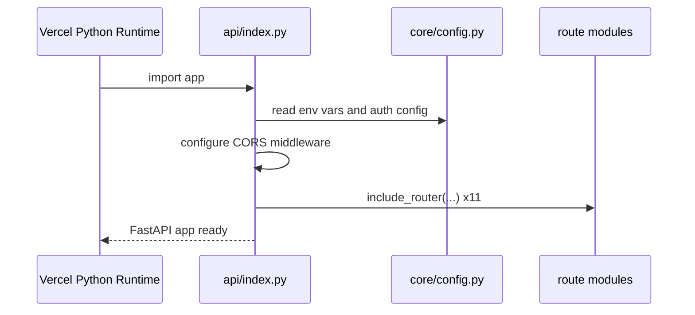
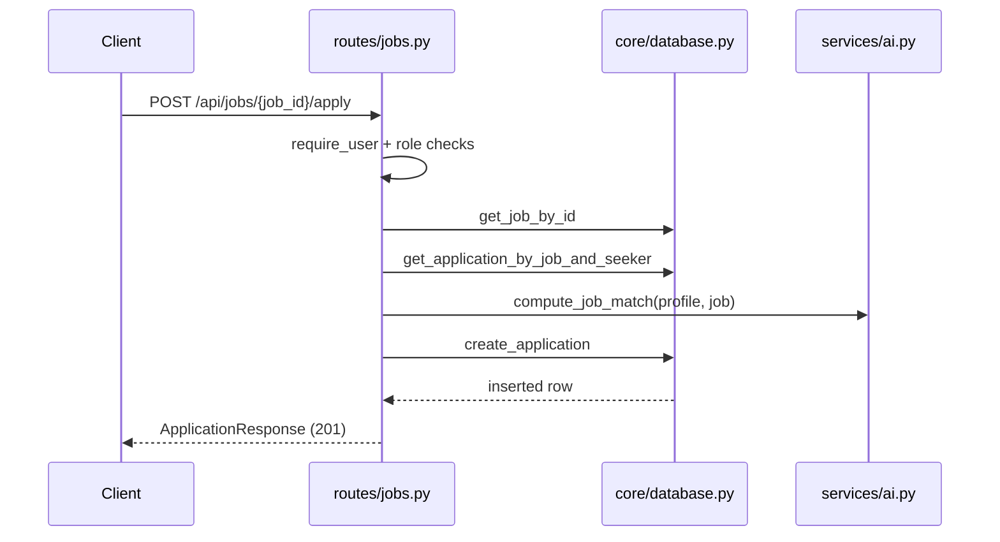
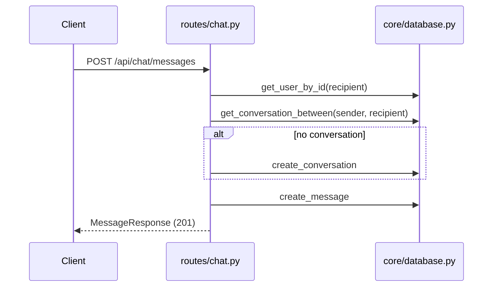
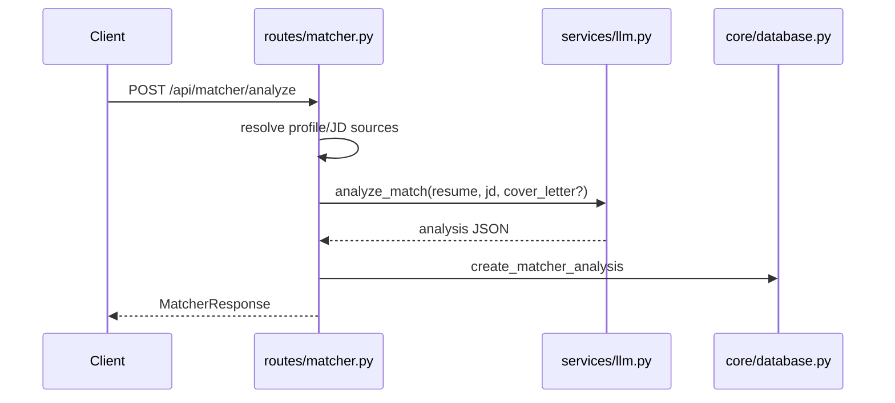

# HireFlow Low-Level Design (LLD) for Developers

This document is implementation-oriented and complements architecture-level docs. It maps modules, contracts, and extension points to current code.

## 1. Scope and Audience

Audience:
- Backend developers (FastAPI + Supabase)
- Frontend/mobile developers integrating APIs
- QA and automation engineers validating service contracts

Goals:
- Make feature delivery predictable
- Reduce ambiguity in route/service/database boundaries
- Provide concrete guidance for adding or changing behavior safely

Companion LLDs:
- Backend: [LLD-BACKEND.md](LLD-BACKEND.md)
- Frontend and mobile: [LLD-FRONTEND-MOBILE.md](LLD-FRONTEND-MOBILE.md)
- QA and regression: [LLD-QA.md](LLD-QA.md)

Approved fast-gate workflow:
- Windows/PowerShell: [tools/verify.ps1](../tools/verify.ps1)
- Cross-platform: [tools/verify.mjs](../tools/verify.mjs)
- Optional local PR e2e subset:
  - `./tools/verify.ps1 -IncludeE2E`
  - `node tools/verify.mjs --include-e2e`

## 2. Repository Module Map

## 2.1 Backend

Path: `backend/api/`

- `index.py`
  - App bootstrap, CORS setup, exception handler for Supabase transport failures
  - Router registration and health endpoints
- `core/config.py`
  - Security primitives: bcrypt hashing, JWT create/decode, auth dependencies
- `core/database.py`
  - Single abstraction layer for all Supabase operations
- `models/schemas.py`
  - Pydantic contracts (requests/responses, enums)
- `routes/*.py`
  - HTTP entrypoints and route-level authorization
- `services/*.py`
  - AI/business integrations (LLM, resume parsing, jobs providers, blog enrichment)

## 2.2 Web frontend

Path: `frontend/src/`

- `App.jsx`
  - Main app shell and state orchestration
- `api.js`
  - HTTP client and token handling
- `lib/routing.js`
  - Page-path mapping and parsing
- `pages/`, `features/`, `components/`
  - UI screens, feature blocks, reusable primitives

## 2.3 Mobile frontend

Path: `mobile/src/`

- `services/api.js`
  - API client with SecureStore/localStorage token persistence
- `services/AuthContext.js`
  - Auth state provider and bootstrapping
- `navigation/AppNavigator.js`
  - Role-based tab routing
- `screens/*.js`
  - Feature screens

## 3. Backend Runtime Design

## 3.1 App initialization sequence

## 3.2 Middleware and global handlers

- CORS configured via `ALLOWED_ORIGINS`
- `httpx.TransportError` global handler returns HTTP 503 with stable payload
- Health probes:
  - `GET /api`
  - `GET /api/health` (includes DB reachability + counts)

## 4. Auth and Security LLD

## 4.1 JWT strategy

- Algorithm: HS256
- Claims:
  - `sub`: user id
  - `exp`: expiration timestamp
- Token lifetime: 7 days (`ACCESS_TOKEN_EXPIRE_MINUTES = 60*24*7`)

## 4.2 Route auth dependencies

- `get_current_user`:
  - Returns `None` for missing/invalid token
  - Returns user dict for valid token
- `require_user`:
  - Raises HTTP 401 if unauthenticated

Usage pattern:
- Public routes: optional or no dependency
- Protected routes: inject `Depends(require_user)`

## 4.3 Password handling

- Hash: passlib bcrypt context
- Verify: bcrypt compare via `verify_password`

## 4.4 Data access security

- Supabase RLS enabled on all core tables
- Backend uses service-role key server-side through `core/database.py`
- Clients never call Supabase directly

## 5. API Surface LLD

## 5.1 Route groups and ownership

| Prefix | Module | Core responsibility |
|---|---|---|
| `/api/auth` | `routes/auth.py` | registration/login/token issue |
| `/api/seeker` | `routes/seeker.py` | profile/resume/matches/analytics |
| `/api/jobs` | `routes/jobs.py` | jobs CRUD/search/applications |
| `/api/recruiter` | `routes/recruiter.py` | candidate search/pipeline/analytics |
| `/api/company` | `routes/company.py` | dashboard/recommendations/analytics |
| `/api/chat` | `routes/chat.py` | conversations and messages |
| `/api/matcher` | `routes/matcher.py` | resume-JD analysis and cover-letter generation |
| `/api/features` | `routes/features.py` | feature request board lifecycle |
| `/api/blog` | `routes/blog.py` | public blog + admin operations |
| `/api/scout` | `routes/scout.py` | AI career assistant |
| `/api/interview` | `routes/interview.py` | mock interview sessions/transcription/evaluation |

## 5.2 Contract conventions

- Success responses:
  - JSON objects or arrays shaped by Pydantic response models
- Error responses:
  - `HTTPException` with `detail`
- Common status codes:
  - `200` success read/update
  - `201` create
  - `400` validation/business rule
  - `401` unauthenticated
  - `403` unauthorized
  - `404` not found
  - `409` conflict (duplicate resource)
  - `502` downstream AI/service failure
  - `503` unavailable dependency

## 6. Service Layer LLD

## 6.1 `services/ai.py`

Responsibilities:
- `compute_job_match(...)`
  - LLM-first matching when OpenAI key is configured
  - Rule-based fallback on failure/unconfigured key
- Resume text extraction and profile inference for uploads

Behavioral guarantees:
- Match score constrained to `[15, 99]`
- Returns deterministic structure:
  - `match_score`, `matched_required`, `matched_nice`, `match_reasons`

## 6.2 `services/llm.py`

Responsibilities:
- Provider abstraction for OpenAI and Anthropic
- Core matcher ops:
  - `analyze_match`
  - `generate_cover_letter`
  - `improve_cover_letter`

Failure semantics:
- Missing API key -> runtime error mapped to HTTP 503 by caller routes
- Invalid JSON from model -> sanitized/parsed with defaults

## 6.3 `services/jobs_api.py`

Responsibilities:
- Aggregate/search jobs from external providers
- Used by jobs search and scout assistant

## 6.4 `services/blog_ai.py`

Responsibilities:
- Enrich blog drafts with SEO metadata and related skill tags

## 7. Database LLD

## 7.1 Access rules

- Only `core/database.py` can issue Supabase queries
- Routes may not perform direct Supabase SDK calls
- JSONB fields are normalized by helper functions inside `database.py`

## 7.2 Core entities

- Users domain:
  - `users`
- Hiring domain:
  - `jobs`, `applications`
- Messaging domain:
  - `conversations`, `conversation_participants`, `messages`
- Matcher domain:
  - `matcher_analyses`
- Feature board domain:
  - `feature_requests`, `feature_votes`, `feature_comments`
- Content domain:
  - `blog_posts`

## 7.3 Key constraints

- Unique application per job/seeker pair
- Enum-like checks for status/category fields in migrations
- Trigger increments `jobs.applicant_count` on new application insert

## 8. Detailed Flow LLD

## 8.1 Job application flow

## 8.2 Chat send flow

## 8.3 Matcher analyze flow

## 9. Frontend Integration LLD

## 9.1 Web client API contract notes

- Base URL: `VITE_API_URL` (falls back to same-origin)
- Bearer token stored in `localStorage` key `jobssearch_token`
- `_fetch` normalizes API errors by extracting `detail`

Known integration caveat:
- Ensure path parity with backend route names when adding new methods (legacy aliases may drift)

## 9.2 Mobile client API contract notes

- Base URL from `mobile/src/constants/config.js`
- Token persistence:
  - native: Expo SecureStore
  - web fallback: localStorage
- Role-based tabs selected by authenticated user role in navigator

## 10. Development Rules (Must Follow)

1. Add/update Pydantic models first in `models/schemas.py`.
2. Implement data reads/writes in `core/database.py` only.
3. Keep route handlers thin:
   - validate/authorize
   - call service + database helpers
   - map exceptions to HTTP
4. Add tests for each changed route/service path.
5. Preserve response shape compatibility for existing clients.

## 11. Adding a New Backend Feature (Template)

1. Add migration SQL for new table/index/check constraints.
2. Add database helper functions in `core/database.py`.
3. Add request/response models in `models/schemas.py`.
4. Add service module function if business logic is non-trivial.
5. Add/extend route endpoints.
6. Wire router in `index.py`.
7. Add unit + integration tests.
8. Update docs:
   - `docs/ARCHITECTURE.md`
   - this file

## 12. Testing LLD

Backend test layers:
- Unit tests: pure logic and edge cases
- Integration tests: route + dependency behavior with mocked/exercised DB boundaries
- Regression suites: multi-step scenarios and cross-domain paths

Recommended minimum per feature:
- 1 happy-path API test
- 1 auth/permission test
- 1 validation or conflict test
- 1 failure-path test for upstream dependency errors

## 13. Observability and Ops Notes

Current state:
- Basic exception handling exists
- Health endpoints available

Recommended next additions:
- Request correlation IDs
- Structured logs per route
- Metrics around AI latency and failure rates
- Alerting for repeated 5xx on AI-dependent routes

## 14. Open Refactor Targets

- Split `core/database.py` by domain (`database_users.py`, `database_jobs.py`, etc.)
- Extract large AI-heavy route modules (`scout.py`, `interview.py`) into cleaner service/use-case classes
- Introduce shared error mapper for consistent external-service failure handling
